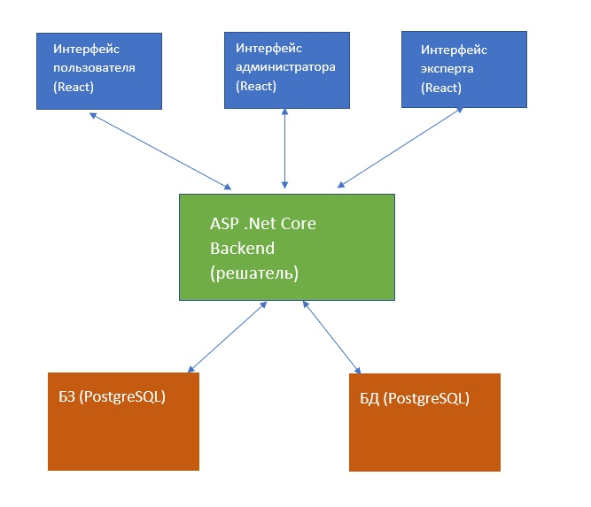

# Книжный консультант

Наша система: книжный консультант

Ее суть: пользователь отвечает на вопросы консультанта, и в результате консультант советует пользователю книги

В нашей системе есть несколько страниц:
- Страница Консультант - на ней пользователь отвечает на вопросы и получает ответ системы
- Страница Жанры - на ней редактируются жанры и их ассоциации с книгами
- Страница Рейтинги - на ней редактируются рейтинги и их ассоциации с книгами
- Страница Теги - на ней редактируются теги и их ассоциации с книгами

В нашей системе есть 3 вида пользователей: обычный юзер, эксперт, администратор. Они отличаются уровнем прав: 
- Админ имеет доступ ко всем ресурсам
- Эксперт - только к редактированию тегов и к консультанту
- Обычный юзер - только к консультанту

Также наша система умеет обосновывать выбор книги. Она это делает на основе ответов на вопросы пользователя, указывая ответ на какой именно вопрос повлиял на выдачу данной книги. Если книга выдалась на основе нескольких ответов, то система скомбинирует вопросы и напишет их рядом с книгой

Базой данных является список книг

Базой знаний являеются ассоциации:
- теги -> книги
- жанры -> книги
- рейтинги -> книги

Схема:

